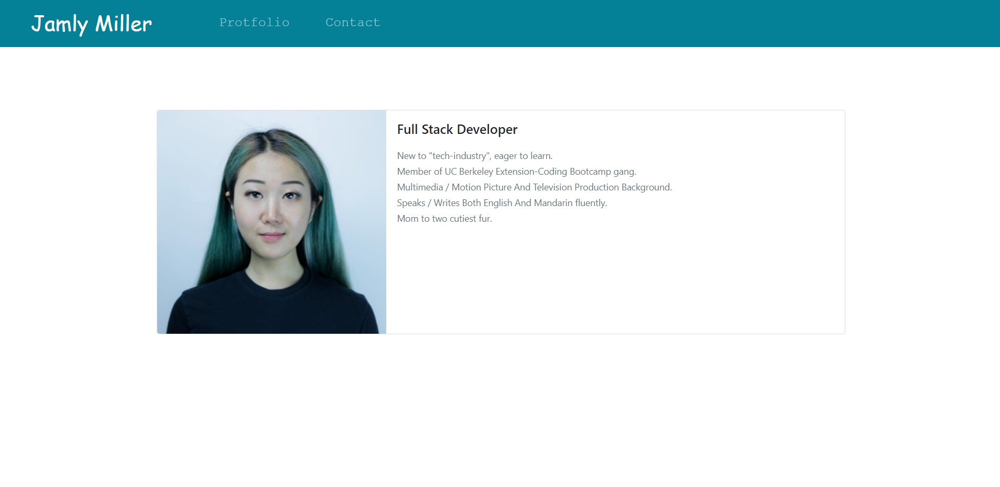
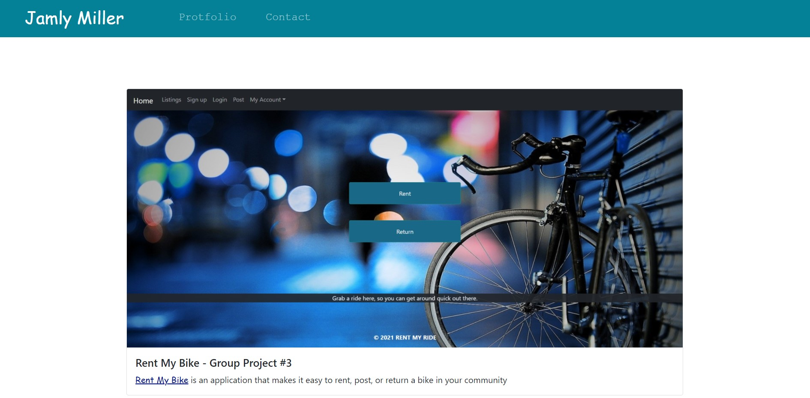
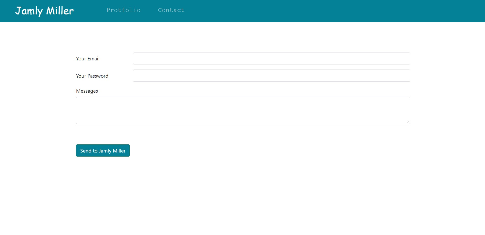

# CSS and Bootstrap: Responsive Portfolio


## Description


## User Story


 
## Table of Contents


* [Usage](#usage)
* [Installation](#installation)
* [Technologies](#technologies)
* [Tests](#tests)
* [Fun](#fun)
* [Challenges](#challenges)
* [Finished Product](#finished-product)
* [Questions](#questions)
* [Learn More](#learn-more)


## Usage

```


```


## **Installation**

Git : https://git-scm.com/downloads

VS Code : https://code.visualstudio.com/download


## Technologies

* Git (a command line tool that connects local to github)

* GitHub (a Git repository hosting service that provides a Web-based graphical interface as well as access control and several collaboration features for every project)

* VS Code (Visual Studio Code is a streamlined code editor with support for development operations)


## Testes

Test application by opening ``` index.html ``` with default browser.

                                            
## Fun


##  Challenges


## Finished Product

GitHub Page: https://jamly-miller.github.io/CSS-and-Bootstrap-Responsive-Portfolio/
Main Page:


Portfolio Page:


Contact Page:



## Questions

If you have any further questions, please contact me:

GitHub: https://github.com/Jamly-Miller

LinkedIn: https://www.linkedin.com/in/jamly-miller-125307200/


## Learn More

Wikipedia - Bootstrap : https://en.wikipedia.org/wiki/Bootstrap_(front-end_framework)

